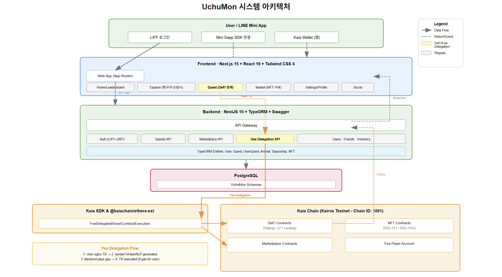

# 카이아 체인 DeFi 게임화 플랫폼: UchuMon

카이아 체인에서 멋진 DeFi를 만드는 것도 중요하지만, 그보다 먼저 **사람들이 이 생태계에 '참여하고 싶게' 만드는 것**이 핵심입니다.
**DeFi를 즐기고, 게임을 공유하고, NFT를 자랑하는 경험**—이것이 우리가 제안하는 시작점입니다.

## 라인 소셜 인프라 = 최고의 온보딩 통로

카이아는 **LINE의 방대한 사용자 기반**을 온보딩 엔진으로 삼습니다.
**LINE Mini App SDK**를 통해 Web3 이용자뿐 아니라 **Web2 초보자도 쉽게 들어올 수 있는 진입로**를 제공합니다. 자연스러운 관심 → 설치 없이 진입 → 첫 경험까지의 흐름을 짧고 간결하게 만들었습니다.

## 게임으로 번역된 DeFi

우리는 금융 UI 대신 **게임 문법**으로 접근합니다.
우주 탐험 콘셉트 속 **퀘스트 = DeFi 액션(스테이킹, LP 제공, 렌딩)** 입니다. 플레이어는 퀘스트를 깨며 장비를 강화하고 행성을 탐험하고, 그 과정에서 **DeFi의 기본 원리를 자연스럽게 체감**합니다. 결과물로 **귀여운 캐릭터 NFT**를 획득해 성취가 눈에 보이게 합니다.

### 🐾 동물 파트너 시스템

- **Momoco** (강아지): 민첩성 특화 캐릭터
- **Panlulu** (판다): 체력 회복 전문가
- **Hoshitanu** (너구리): 지능 특화 캐릭터
- **Mizuru** (고양이): 균형잡힌 능력치

각 캐릭터는 DeFi 활동을 통해 성장하며, 레벨과 스탯이 우주 탐험 성공률에 직접적인 영향을 미칩니다.

### 🚀 우주선 강화 시스템

엔진, 재료, 특수 장비, 연료 아이템을 통한 단계적 강화:

- **스테이킹**: USDT 스테이킹으로 동물 체력 개선 및 연료 획득
- **LP 제공**: KAIA-USDT 유동성 공급으로 우주선 엔진 부품 획득
- **렌딩**: USDT 예치로 동물 지능 향상 및 특수 장비 획득

## NFT와 마켓: 소유·교환의 손맛

게임 내 **장비(ERC-1155)**와 **캐릭터 NFT(ERC-721)**는 **탈중앙 마켓플레이스**에서 자유롭게 거래됩니다.
사용자는 자신이 획득한 자산을 **진짜로 소유**하고, **구매·판매·교환**을 통해 **가치를 직접 만들어** 갑니다. 블록체인은 이 전 과정을 투명하게 보증해, 단순한 게임을 넘어 **경제 활동의 재미**를 제공합니다.

## 공유가 만드는 바이럴 루프

보상은 숫자가 아니라 **자랑거리**가 되도록 설계했습니다.
획득한 캐릭터·탐험 기록을 **LINE 메시지로 한 번에 공유**할 수 있고, 이 공유가 새로운 유입으로 이어집니다. 특히 **일본 시장 취향을 반영한 아트 디렉션**은 확산에 힘을 보탭니다.

## 가스 없는 플레이, 마찰 없는 시작

블록체인이 처음인 사람도 부담 없이 시작하도록, **트랜잭션 가스비는 백엔드에서 대납**합니다.
복잡한 지갑 설정이나 수수료 걱정 없이 **플레이와 보상에만 집중**하게 만들어 참여 장벽을 실질적으로 낮춥니다.

---



## 🏗️ 기술 아키텍처

### 백엔드 (NestJS 기반)  https://github.com/kaia-baytamins/backend

- **프레임워크**: NestJS 10.x + TypeScript 5.x
- **데이터베이스**: PostgreSQL + TypeORM
- **블록체인**: Kaia Chain + ethers.js + @kaiachain/ethers-ext
- **인증**: JWT + LINE LIFF
- **API 문서화**: Swagger/OpenAPI

### 프론트엔드 (Next.js 15 기반) https://github.com/kaia-baytamins/fe

- **프레임워크**: Next.js 15.5.0 (App Router)
- **UI**: React 19.1.0 + Tailwind CSS 4
- **블록체인**: Kaia SDK + ethers.js v5
- **지갑**: Kaikas Wallet
- **소셜 로그인**: LINE LIFF

### 핵심 기술: Fee Delegation (가스비 대납)

### 🔄 트랜잭션 플로우

1. **사용자 액션**
    
    ```tsx
    // 프론트엔드: DeFi 참여 버튼 클릭
    handleParticipateDefi(100) // 100 USDT 스테이킹
    
    ```
    
2. **트랜잭션 준비**
    
    ```tsx
    // 백엔드: 스마트 컨트랙트 트랜잭션 데이터 준비
    prepareDefiTransaction('staking', '100')
    // Gas 예측 및 최적화
    
    ```
    
3. **사용자 서명**
    
    ```tsx
    // Kaia SDK로 Fee Delegated Transaction 생성
    const tx = {
      type: TxType.FeeDelegatedSmartContractExecution,
      from: userAddress,
      to: contractAddress,
      data: transactionData,
      gasLimit: gasLimit,
      gasPrice: gasPrice
    };
    
    // Kaikas 지갑으로 서명
    const signedTx = await window.klaytn.request({
      method: 'klay_signTransaction',
      params: [tx]
    });
    
    ```
    
4. **Fee Delegation 실행**
    
    ```tsx
    // 백엔드: Fee Payer가 가스비 대납
    const txResponse = await executeFeeDelegation({
      from: userAddress,
      to: contractAddress,
      data: transactionData,
      signedMessage: senderTxHashRLP
    });
    
    ```
    

### **카이아 체인의 핵심 차별점: 마찰 없는 경험의 완성**

DeFi를 대중화하기 위해 가장 중요한 것은 사용자들이 블록체인의 복잡함을 느끼지 않게 만드는 것입니다. 그중에서도 **'가스비'**는 Web2 사용자에게 가장 큰 진입 장벽입니다. 우리는 이 문제를 **카이아 체인의 Fee Delegation**이라는 독점적인 기술을 통해 완벽하게 해결했습니다.

이것은 단순한 기능이 아니라, 우리 프로젝트가 사용자에게 **Web2 수준의 매끄러운 경험**을 제공할 수 있는 핵심적인 강점입니다.

---

### **1. Zero Gas Fee: 진정한 '무료' 경험**

사용자는 모든 게임 액션(스테이킹, LPing, NFT 거래 등)에 대해 **가스비 걱정 없이** 참여할 수 있습니다. 수수료를 지불해야 한다는 부담감은 Web2 사용자에게 낯설고 불편한 경험인데, Fee Delegation을 통해 이를 완전히 제거했습니다. 사용자는 오직 게임과 보상에만 집중할 수 있으며, 이는 곧 **참여율과 잔존율 증가**로 이어집니다.

---

### **2. 강화된 보안성: 사용자의 통제권 보장**

일반적으로 가스비 대납 시스템은 사용자의 Private Key를 서버에 전송하는 위험을 수반하기도 합니다. 하지만 카이아의 Fee Delegation은 다릅니다. 사용자는 자신의 기기에서 직접 트랜잭션에 서명하고, **오직 서명된 트랜잭션 데이터만** 백엔드로 전송됩니다. 사용자의 **민감한 Private Key는 절대 서버에 노출되지 않으며**, 백엔드는 단순히 가스비를 대신 지불하는 역할만 수행합니다. 이는 사용자에게 높은 보안 신뢰를 제공합니다.

---

### **3. 실시간 처리: 게임의 흐름을 끊지 않는 속도**

Kaia SDK의 독특한 **`senderTxHashRLP`** 방식은 트랜잭션 서명과 처리를 매우 빠르게 만듭니다. 이는 지연 없는 **실시간 처리**를 가능하게 하여 게임의 속도감과 즉각적인 보상 경험을 유지시켜 줍니다. 블록체인 트랜잭션이 게임의 몰입도를 방해하는 것이 아니라, 오히려 **원활한 플레이 경험의 일부**가 됩니다.

---

이렇듯 Line의 탄탄한 소셜 인프라와 다가가기 쉽게 설계된 게이밍 Defi, 가스리스 UX를 통해 사람들이 재미를 느끼고 콘텐츠를 공유하며 더 많은 참여를 이끌어낼 수 있고 이는 최종적으로 KAIA 체인 생태계의 활성화를 불러오게 될 것입니다.

프로젝트 데모 영상: [](https://youtu.be/rSqFfBLWnKk)
